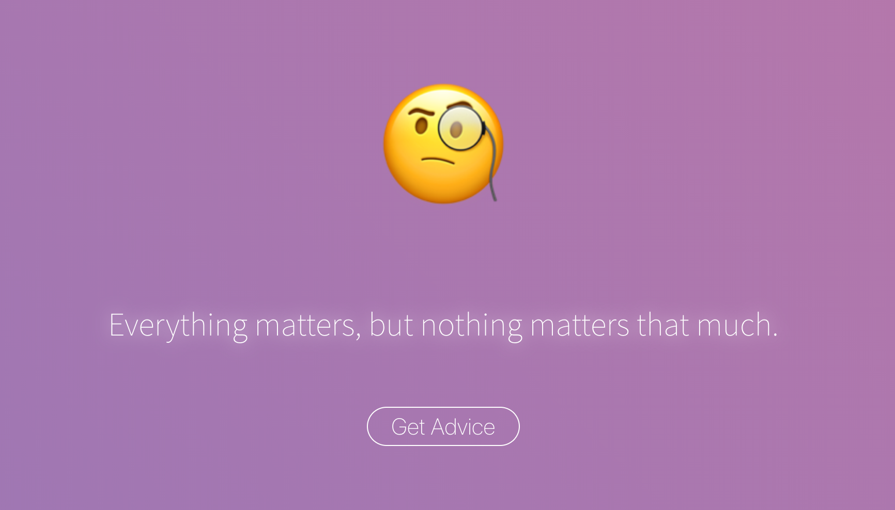

# vuedvice



A simple app experiment to fetch advices from [adviceslip.com](https://api.adviceslip.com/)

Check the demo [here](https://vnakamura.github.io/vuedvice/).

## Project setup

```
npm install
```

### Compiles and hot-reloads for development

```
npm run serve
```

### Compiles and minifies for production

```
npm run build
```

### Push new version to GitHub Pages

```
npm run deploy
```

### Lints and fixes files

```
npm run lint
```

### Customize configuration

See [Configuration Reference](https://cli.vuejs.org/config/).
